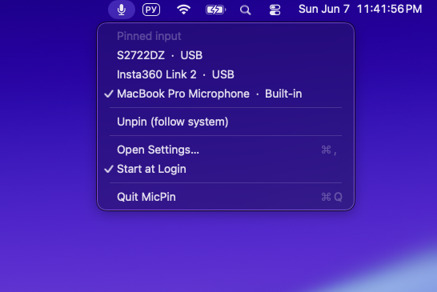

# MicPin

[English](README.md) · **Русский**

Маленькое приложение для macOS в строке меню, которое **закрепляет один
микрофон** как вход по умолчанию. macOS любит переключать вход на микрофон
Bluetooth-гарнитуры сразу после подключения (а заодно роняет гарнитуру в
низкокачественный профиль HFP). MicPin держит выбранный микрофон по умолчанию и
возвращает его, как только что-то пытается переключить.

<p align="center">
  
</p>

## Установка

1. Скачайте `MicPin-<версия>.dmg` со страницы
   [последнего релиза](../../releases/latest).
2. Откройте DMG и перетащите **MicPin** в папку **Applications**.
3. Запустите MicPin из Applications. В строке меню появится иконка микрофона.

> **Первый запуск — Gatekeeper.** Приложение с открытым исходным кодом и
> подписано ad-hoc (без нотаризации Apple), поэтому при первом запуске macOS
> может сказать, что его «нельзя открыть». Кликните по приложению правой
> кнопкой → **Открыть** → **Открыть**, либо выполните один раз:
> ```bash
> xattr -dr com.apple.quarantine /Applications/MicPin.app
> ```

## Как это работает

- Выберите микрофон в меню (или в окне настроек), чтобы **закрепить** его.
- Пока закреплённый микрофон подключён, MicPin держит его входом по умолчанию —
  даже когда подключаются новые устройства или другое приложение пытается
  переключить.
- Если закреплённый микрофон **отключён**, MicPin ничего не делает — macOS
  выбирает сам. Когда микрофон возвращается, MicPin снова делает его входом.
- Чтобы сменить микрофон, закрепите другой в MicPin. (Ручное переключение в
  «Системных настройках» откатывается, пока активен пин — в этом и смысл.)

MicPin только читает метаданные устройств и задаёт свойство «вход по умолчанию».
Он никогда не записывает звук и не требует доступа к микрофону.

## Требования

- macOS 26 (Tahoe) или новее

## Сборка из исходников

Нужен тулчейн Swift 6.3+ (рекомендуется полный Xcode).

```bash
git clone https://github.com/samplec0de/micpin.git
cd micpin
./scripts/bundle.sh     # собирает dist/MicPin.app
./scripts/make_dmg.sh   # собирает dist/MicPin-<версия>.dmg
```

`bundle.sh` сам использует полный Xcode, если выбраны только Command Line Tools.
(Либо выбрать Xcode глобально:
`sudo xcode-select -s /Applications/Xcode.app`.)

## Разработка

```bash
swift build      # сборка
swift test       # юнит-тесты ядра
```

Если `swift` указывает на Command Line Tools и `swift test` пишет
`no such module 'Testing'`, добавьте префикс с полным тулчейном:

```bash
DEVELOPER_DIR=/Applications/Xcode.app/Contents/Developer swift test
```

Откройте `Package.swift` в Xcode для отладки.

## Архитектура

- `MicPinCore` — логика пина за протоколом `AudioSystem` плюс реализация на
  CoreAudio. Устройства определяются по стабильному UID. Ядро полностью покрыто
  юнит-тестами с in-memory фейком.
- `MicPin` — строка меню на AppKit (`NSStatusItem`) и окно настроек на SwiftUI.

## Лицензия

MIT — см. [LICENSE](LICENSE).
